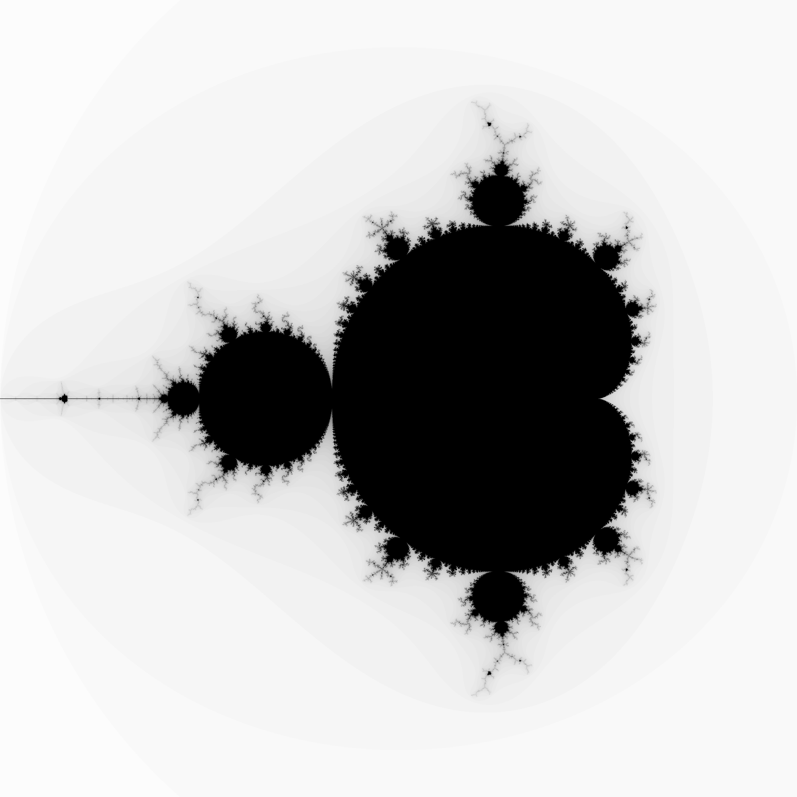

# Language Comparison with Mandelbrot set


- Comparison of languages at computing Mandelbrot set.
- Comparison of languages at writing JSON file.
- Serves a web page to visualize the results.

This preview is the Mandelbrot set 2000 by 2000 pixels generated by `Rust` implementation in less than 3 seconds and displayed by `Javascript` canvas.


__Your job would be:__
- To create a folder with the language name, ex: `./python`
- To translate the `Mandelbrot algorithm` described below
- To write a `json` file for check the result `./display/mandelbrot/python.json`
- To record the time elapsed to do this two operations (in nanoseconds)

## Mandelbrot algorithm

This is the pseudo-code in which are based the programs.

Source: [Wikipedia](https://en.wikipedia.org/wiki/Plotting_algorithms_for_the_Mandelbrot_set)

```
for each pixel (Px, Py) on the screen do
    x0 := scaled x coordinate of pixel (scaled to lie in the Mandelbrot X scale (-2.00, 0.47))
    y0 := scaled y coordinate of pixel (scaled to lie in the Mandelbrot Y scale (-1.12, 1.12))
    x := 0.0
    y := 0.0
    iteration := 0
    max_iteration := 1000
    while (x*x + y*y ≤ 2*2 AND iteration < max_iteration) do
        xtemp := x*x - y*y + x0
        y := 2*x*y + y0
        x := xtemp
        iteration := iteration + 1
 
    color := palette[iteration]
    plot(Px, Py, color)
```

## Results

Each language measure the time in seconds to:
1) compute the Mandelbrot set
2) write the `JSON` data

Then I write down performances in a result file.

Incoming.

| Language | MIN time Mandel. | MAX time Mandel. | **AVG time Mandel.** | MIN time write file | MAX time write file | **AVG time write file** | **Size of compiled exe. (kb)** | Notes |
| --- | --- | --- | --- | --- | --- | --- | --- | --- |
| Rust | 0.429 | 3.078 | **2.220** | 0.465 | 3.009 | **1.394** | **173** | Long time to dev and debug |
| Go | 0.185 | 2.877 | **2.136** | 0.135 | 2.600 | **0.633** | **1516** | Very short dev time |
| Java | 2.739 | 2.881 | **2.836** | - | - | - | - | Lot of various issues |
| Javascript on chromium | ... | ... | ... | ... | ... | ... | - | ... |
| Javascript on node.js | ... | ... | ... | ... | ... | ... | - | ... |
| Python | ... | ... | ... | ... | ... | ... | - | ... |
| C | ... | ... | ... | ... | ... | ... | ... | ... | 
| C++ | ... | ... | ... | ... | ... | ... | ... | ... | 
| C# | ... | ... | ... | ... | ... | ... | ... | ... | 

## How does it work

For all language implementation, there's a folder with source code.

For all of them, the program:
1) Run the mandelbrot algorithm measuring the time elapsed in nanoseconds.
2) Write a `json` file in `./display/mandelbrot` and measure the time elapsed to write file.

A `go` server serves static files in `./display`.
The web page is extremely compact, the `js` script fetches the `json` data from `./display/mandelbrot` to display it, so we can ensure the algorithm are doing their job correctly.

## Code

### Rust

I used vectors with rust, which is probably a bad idea to get best performances from the language.

*3 hours dev*

> `cargo build --release`

> `./target/release/rust`

```rust
fn mandlebrot() -> Vec<Vec<usize>> {
    const WIDTH: usize = 2_000;
    const HEIGHT: usize = 2_000;
    const MAX_ITER: usize = 1000;

    const X_SCALE_MIN: f64 = -2.0;
    const X_SCALE_MAX: f64 = 1.0;
    const Y_SCALE_MIN: f64 = -1.5;
    const Y_SCALE_MAX: f64 = 1.5;

    const X_SLOPE: f64 = (X_SCALE_MAX - X_SCALE_MIN) / WIDTH as f64;
    const Y_SLOPE: f64 = (Y_SCALE_MAX - Y_SCALE_MIN) / HEIGHT as f64;

    dbg!(X_SLOPE);
    dbg!(Y_SLOPE);

    let mut plot: Vec<Vec<usize>> = vec![vec![0; WIDTH]; HEIGHT];

    for py in 0..HEIGHT {
        for px in 0..WIDTH {
            let x0: f64 = X_SLOPE * px as f64 + X_SCALE_MIN;
            let y0: f64 = Y_SLOPE * py as f64 + Y_SCALE_MIN;
            let mut x: f64 = 0.0;
            let mut y: f64 = 0.0;
            let mut iteration: usize = 0;

            while x * x + y * y <= 4.0 && iteration < MAX_ITER {
                let x_temp: f64 = x * x - y * y + x0;
                y = 2.0 * x * y + y0;
                x = x_temp;
                iteration += 1;
            }

            plot[py][px] = iteration;
        }
    }
    plot
}
```

### Go

Use of json.Marshal function to convert array into JSON array, and it is pretty fast.

*30 min dev*

> `go build --ldflags "-s" main.go`

> `./main`

```go
func mandelbrot() (plot [HEIGHT][WIDTH]uint64) {
	const MAX_ITER uint64 = 1000

	const X_SCALE_MIN float64 = -2.0
	const X_SCALE_MAX float64 = 1.0
	const Y_SCALE_MIN float64 = -1.5
	const Y_SCALE_MAX float64 = 1.5

	const X_SLOPE float64 = (X_SCALE_MAX - X_SCALE_MIN) / float64(WIDTH)
	const Y_SLOPE float64 = (Y_SCALE_MAX - Y_SCALE_MIN) / float64(HEIGHT)

	fmt.Println(X_SLOPE)
	fmt.Println(Y_SLOPE)

	plot = [HEIGHT][WIDTH]uint64{}

	for py := 0; py < int(HEIGHT); py++ {
		for px := 0; px < int(WIDTH); px++ {
			var x0 float64 = X_SLOPE*float64(px) + X_SCALE_MIN
			var y0 float64 = Y_SLOPE*float64(py) + Y_SCALE_MIN
			var x float64 = 0.0
			var y float64 = 0.0
			var iteration uint64 = 0

			for x*x+y*y <= 4.0 && iteration < MAX_ITER {
				var x_temp float64 = x*x - y*y + x0
				y = 2.0*x*y + y0
				x = x_temp
				iteration++
			}

			plot[py][px] = iteration
		}
	}
	return
}
```

### Java

I used Eclipse IDE for this part.

> `cd java/bin/java`

> `java -jar "myJarFile.jar"`

```java
public static int[][] mandelbrot() {
		int MAX_ITER = 1000;

		double X_SCALE_MIN = -2.0;
		double X_SCALE_MAX = 1.0;
		double Y_SCALE_MIN = -1.5;
		double Y_SCALE_MAX = 1.5;

		double X_SLOPE = (X_SCALE_MAX - X_SCALE_MIN) / (double) Main.WIDTH;
		double Y_SLOPE = (Y_SCALE_MAX - Y_SCALE_MIN) / (double) Main.HEIGHT;

		int[][] plot = new int[Main.HEIGHT][Main.WIDTH];

		for (int py = 0; py < (int) Main.HEIGHT; py++) {
			for (int px = 0; px < (int) Main.WIDTH; px++) {
				double x0 = X_SLOPE * (double) px + X_SCALE_MIN;
				double y0 = Y_SLOPE * (double) py + Y_SCALE_MIN;
				double x = 0.0;
				double y = 0.0;
				int iteration = 0;

				while (x * x + y * y <= 4.0 && iteration < MAX_ITER) {
					double x_temp = x * x - y * y + x0;
					y = 2.0 * x * y + y0;
					x = x_temp;
					iteration++;
				}

				plot[py][px] = iteration;
			}
		}
		return plot;
	}
```

### Python

